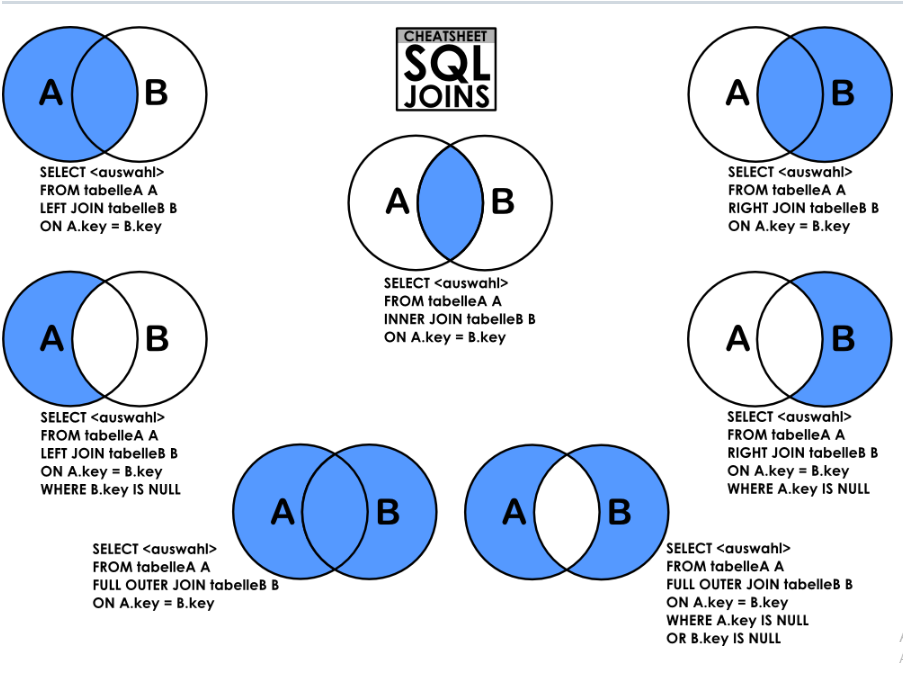

# 🔗 Principais Tipos de JOIN no SQL Server

Os **JOINs** são usados para combinar dados de duas ou mais tabelas com base em uma condição. Aqui estão os principais tipos, suas diferenças e exemplos.  

---

## 📌 **Tipos de JOIN e Seus Usos**

| JOIN           | Descrição | Exemplo Visual |
|---------------|-------------|----------------|
| **`INNER JOIN`** | Retorna apenas os registros que têm correspondência em ambas as tabelas. | 🟢🟢 (apenas interseção) |
| **`LEFT JOIN`** (ou **LEFT OUTER JOIN**) | Retorna todos os registros da **tabela da esquerda**, e os correspondentes da tabela da direita. Se não houver correspondência, retorna `NULL`. | 🟢🟢 ⚪ (tudo da esquerda + interseção) |
| **`RIGHT JOIN`** (ou **RIGHT OUTER JOIN**) | Retorna todos os registros da **tabela da direita**, e os correspondentes da tabela da esquerda. Se não houver correspondência, retorna `NULL`. | ⚪ 🟢🟢 (tudo da direita + interseção) |
| **`FULL JOIN`** (ou **FULL OUTER JOIN**) | Retorna todos os registros das duas tabelas. Se não houver correspondência, retorna `NULL` onde necessário. | 🟢🟢 ⚪ ⚪ (tudo das duas tabelas) |
| **`CROSS JOIN`** | Retorna o **produto cartesiano**, combinando **todas as linhas** da tabela A com todas as linhas da tabela B. | 🔄🔄 (tudo de A × tudo de B) |

---

## 🛠️ **Exemplos Práticos com AdventureWorks**

### 🔹 **1. INNER JOIN (Apenas Correspondências)**
```sql
SELECT P.FirstName, P.LastName, E.HireDate
FROM AdventureWorks2017.Person.Person P
INNER JOIN AdventureWorks2017.HumanResources.Employee E
ON P.BusinessEntityID = E.BusinessEntityID;
```
Retorna apenas funcionários que estão na tabela Person e Employee.

### 🔹 **2. LEFT JOIN (Todos da Esquerda + Correspondências)**
```sql
SELECT C.CustomerID, P.FirstName, P.LastName, SO.TotalDue
FROM AdventureWorks2017.Sales.Customer C
LEFT JOIN AdventureWorks2017.Person.Person P ON C.PersonID = P.BusinessEntityID
LEFT JOIN AdventureWorks2017.Sales.SalesOrderHeader SO ON C.CustomerID = SO.CustomerID;
```
Retorna todos os clientes, mesmo que não tenham pedidos.
Onde não houver pedido (SalesOrderHeader), o valor de TotalDue será NULL.

### 🔹 **3. RIGHT JOIN (Todos da Direita + Correspondências)**
```sql
SELECT E.JobTitle, P.FirstName, P.LastName
FROM AdventureWorks2017.HumanResources.Employee E
RIGHT JOIN AdventureWorks2017.Person.Person P ON E.BusinessEntityID = P.BusinessEntityID;
```
Retorna todas as pessoas, incluindo aquelas que não são funcionários.

### **🔹 4. FULL JOIN (Tudo de Ambas as Tabelas)**
```sql
SELECT P.FirstName, P.LastName, E.JobTitle
FROM AdventureWorks2017.Person.Person P
FULL JOIN AdventureWorks2017.HumanResources.Employee E
ON P.BusinessEntityID = E.BusinessEntityID;
```
Retorna todas as pessoas e todos os funcionários. Quando não há correspondência, os valores de colunas da outra tabela aparecem como NULL.

### **🔹 5. CROSS JOIN (Produto Cartesiano)**
```sql
SELECT P.FirstName, P.LastName, D.Name AS Department
FROM AdventureWorks2017.Person.Person P
CROSS JOIN AdventureWorks2017.HumanResources.Department D;
```
Cada pessoa será combinada com todos os departamentos! Se houver 100 pessoas e 10 departamentos, o resultado terá 1000 linhas.

📌 Resumo Rápido: Quando Usar Cada JOIN?
* ✅ INNER JOIN → Quando precisa apenas dos registros que têm correspondência.
* ✅ LEFT JOIN → Quando quer todos os registros da tabela principal, mesmo sem correspondência.
* ✅ RIGHT JOIN → Similar ao LEFT, mas priorizando a tabela da direita.
* ✅ FULL JOIN → Quando quer todos os registros de ambas as tabelas.
* ✅ CROSS JOIN → Quando precisa combinar tudo com tudo (produto cartesiano).


---
